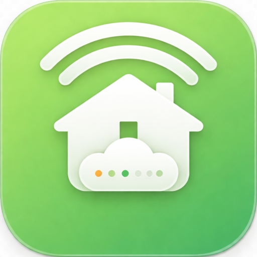
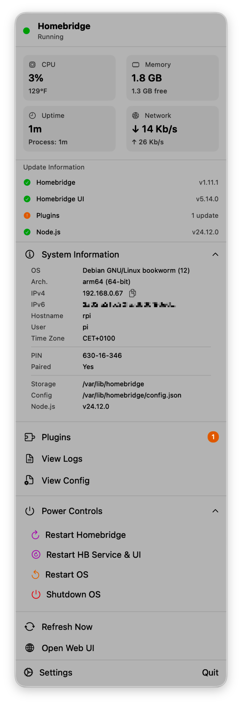
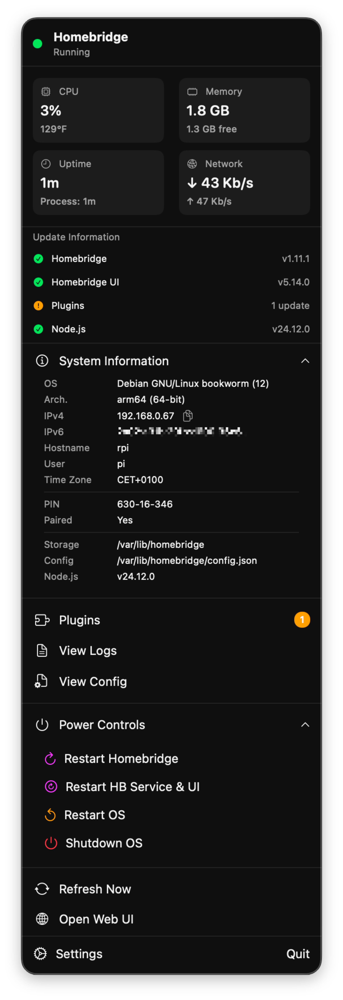

# Home2Bridge

  

  <strong>A lightweight macOS menu bar app for monitoring your Homebridge server</strong>

  
  
  
  

---

## About

Home2Bridge brings your [Homebridge](https://homebridge.io) server status directly to your Mac's menu bar. Monitor CPU usage, memory, uptime, and plugin updates at a glance — without opening a browser.

## Features

### Real-Time Monitoring
- **CPU Usage** — Live CPU load percentage displayed in menu bar
- **Memory Status** — RAM usage with available/total breakdown
- **Server Uptime** — How long your Homebridge has been running
- **Homebridge Status** — Running, stopped, or error state at a glance

### Plugin Management
- View all installed plugins
- See available updates count
- Quick access to plugin list

### Server Control
- Restart Homebridge service
- Restart Homebridge + UI
- Restart host system
- Shutdown host system

### Notifications
Get notified about important events:
- **Plugin Updates** — When plugin updates are available (click to open Plugins window)
- **Homebridge Updates** — New Homebridge version available
- **Homebridge UI Updates** — New UI version available
- **Node.js Updates** — New Node.js version available
- **Homebridge Down** — When Homebridge stops responding
- **High CPU Usage** — When CPU exceeds 80%
- **Low Memory** — When available memory drops below 20%

All notifications are configurable in Settings → Notifications tab.

### Additional Features
- **Logs Viewer** — Browse Homebridge logs directly
- **Config Viewer** — View your config.json
- **System Info** — Server hostname, OS, architecture, IP addresses
- **Pairing Info** — HomeKit PIN and pairing status
- **Auto-refresh** — Configurable refresh interval (5s, 15s, 30s, 60s)
- **Launch at Login** — Start automatically with your Mac
- **Temperature Units** — Celsius or Fahrenheit

## Screenshots

  
  &nbsp;&nbsp;&nbsp;
  

## Requirements

- **macOS 13.0** (Ventura) or later
- **Homebridge** with [homebridge-config-ui-x](https://github.com/homebridge/homebridge-config-ui-x) installed
- Network access to your Homebridge server

## Installation

### Download

1. Go to [Releases](https://github.com/panjakubpl/Home2Bridge/releases/latest)
2. Download `Home2Bridge-x.x.x.dmg`
3. Open the DMG and drag Home2Bridge to Applications
4. Launch Home2Bridge from Applications or Spotlight

### First Launch

On first launch, macOS may show a security warning. To open:
1. Right-click (or Control-click) on Home2Bridge
2. Select "Open" from the context menu
3. Click "Open" in the dialog

## Configuration

1. Click the Home2Bridge icon in your menu bar
2. Go to **Settings** (gear icon)
3. Enter your Homebridge server details:
   - **Server URL**: `http://your-homebridge-ip:8581`
   - **Username**: Your Homebridge UI username
   - **Password**: Your Homebridge UI password
4. Click **Connect**

If you have 2FA enabled, you'll be prompted for the code.

## Privacy

Home2Bridge respects your privacy:

- **No telemetry** — We don't track how you use the app
- **No analytics** — No usage data is collected
- **Local storage only** — Credentials stored securely in macOS Keychain
- **No cloud sync** — All data stays on your Mac

See our full [Privacy Policy](PRIVACY.md).

## Security

- Credentials stored in macOS Keychain (encrypted)
- HTTPS supported for server connections
- Ed25519 signature verification for updates
- No third-party dependencies

See our [Security Policy](SECURITY.md).

## FAQ

### Does this work with Docker Homebridge?
Yes! As long as homebridge-config-ui-x is accessible on the network.

### Can I use this with multiple Homebridge instances?
Currently, Home2Bridge supports one server connection at a time.

### Does it work with Intel Macs?
Yes, Home2Bridge is a Universal Binary supporting both Apple Silicon and Intel.

### Why does the menu bar show "house" instead of CPU%?
CPU percentage is only shown when connected and Homebridge is running.

## Support

If you encounter issues:

1. Check that Homebridge UI is accessible in your browser
2. Verify your credentials are correct
3. Ensure your Mac can reach the Homebridge server

For bugs or feature requests, please [open an issue](https://github.com/panjakubpl/Home2Bridge/issues).

## License

Home2Bridge is released under the [MIT License](LICENSE).

This is an independent project and is not affiliated with or endorsed by Homebridge or Apple Inc.

---

  Made with ❤️ for the Homebridge community

